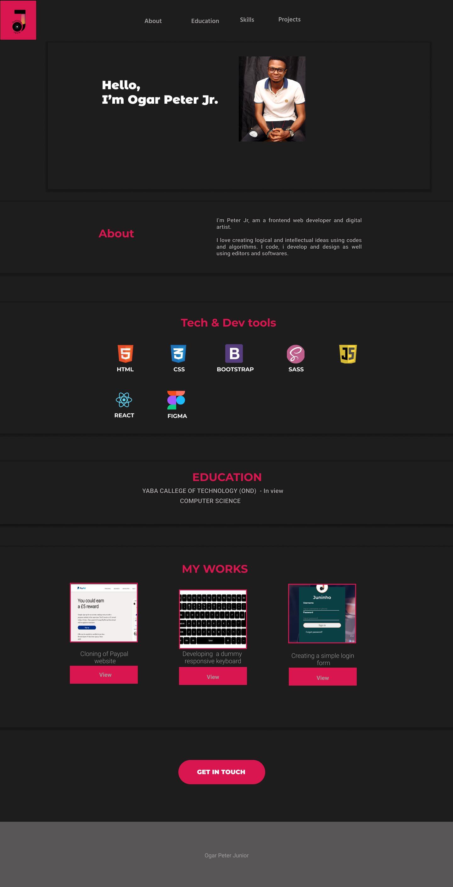

# site
## MY PORTFOLIO
---
# Overview
>>This is my porfolio website i designed and developed from scratched using some techs and dev tools. i started using figma for the UI design and prototyping which was later translated into code. I used HTML for the web structures and SASS CSS for graphical interface and styling. Bootstrap was used for mobile responsive and website layout.

---
# Tech/tools Used
1. HTML
2. CSS
3. Bootstrap
4. bootstrap-icons
5. Font-awesome-icons
6. SASS

---
# Links
[GIthub](https://github.com/Juninhotech) [Figma](https://www.figma.com/proto/gieP591UAWKXEt1q9f6DbH/Untitled?node-id=71%3A16&scaling=min-zoom&page-id=0%3A1&starting-point-node-id=71%3A16&show-proto-sidebar=1)
---
# Credits
        @Juninhotech
        @ProfGreatWonder